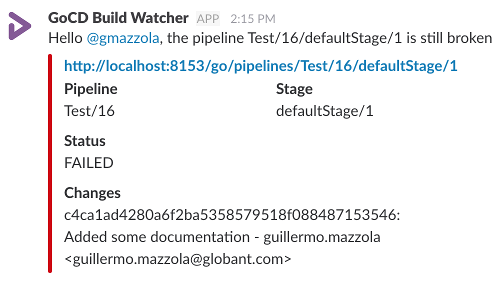
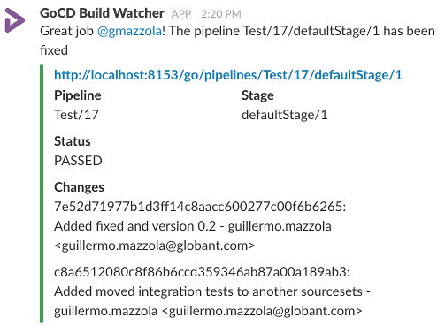
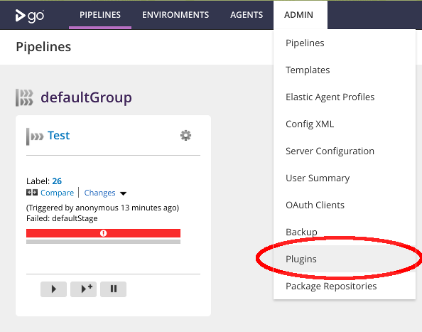
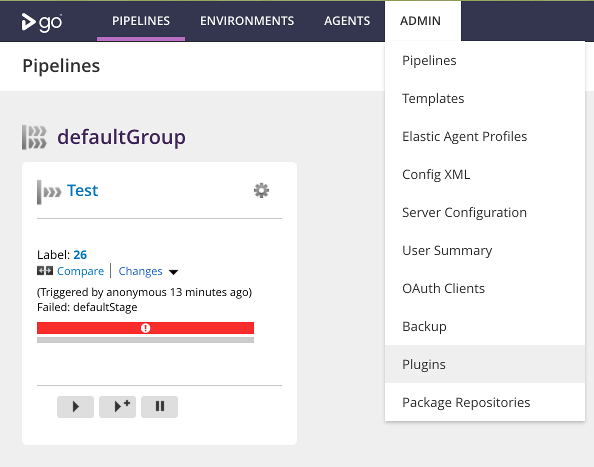
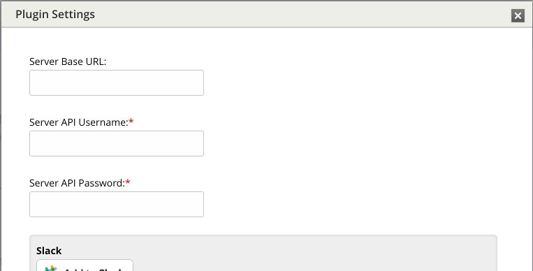
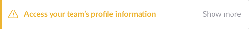

# gocd-build-watcher-plugin
A GoCD notification plugin which sends direct emails and Slack messages to the person who breaks a build
 

# Installation
1. Download the lastest release JAR from jCenter: 
1. Drop it under `$GOCD_DIR/plugins/external`
1. Restart Go Server

## Configuration

### Accesing pluging Settings (on GoCD)

### Access Go Server API
This plugin requires access to Go API to fetch status of previous job execution and material changes.
If you are enforced to login before you can access the main pipelines screen, you need to provide a valid user/password to our plugin.
1. Enter [plugin settings](#access-go-server-api)
2. Enter API username and password:

### Adding Slack notifications
As this pluging needs to resolve user's email into a Slack ID, a *WebHook* is not enough to work.
You need to install our Slack App into your team and get an API token.
>  
> You may see this warning when authorizing our app to work with your team.
> We will only access your team profile in order to match a email from a Material change into a Slack ID
1. Install our app into your team:  
2. Copy your Slack API Token into GoCD's plugin configuration
3. (optional) Configure a custom channel or slack id for the bot. Enter [plugin settings](#access-go-server-api) and then:

### Adding Email notifications
1. Configure your SMTP server details
2. If you SMTP requires authentication, provide your account/password
3. Provide a From email, the one our plugin will be sending email on behalf
4. Provide an optional CC, this email will copied every time an email is sent

## Customization
- **Pipeline Broken Message**: sent to a user when a specific pipeline is broken (the build fails) by the last commit
- **Pipeline Still Broken Message**: sent to a user when a specific pipeline was broken and the last commit didn' fix it
- **Pipeline Fixed Message**: sent to a user when a specific pipeline was broken the last commit fixed it
